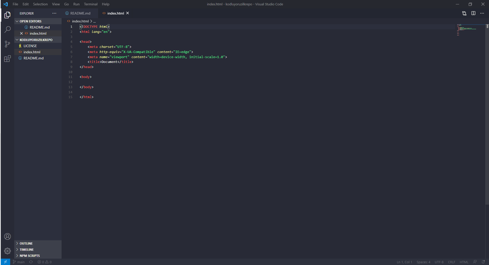

# Kodluyoruz Ilk Repo

Bu repo [Kodluyoruz](https://www.kodluyoruz.org/) Front-End Eğitiminde oluşturduğuımuz ilk repo. İçerisinde bir adet README dosyası, bir adet de index.html barındırıyor.

# Installation

```bash
git clone https://github.com/VolkanTemel/kodluyoruzilkrepo
```

# Usage

```bash
cd kodluyoruzilkrepo
code .
```

